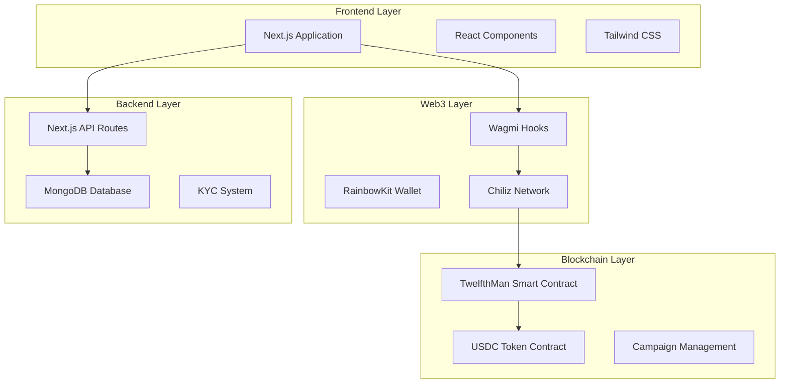
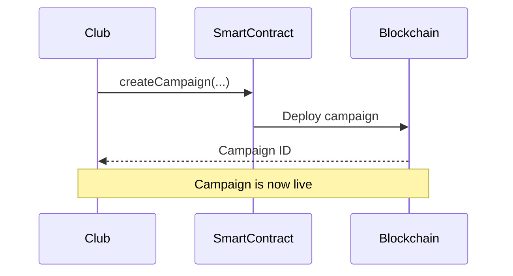
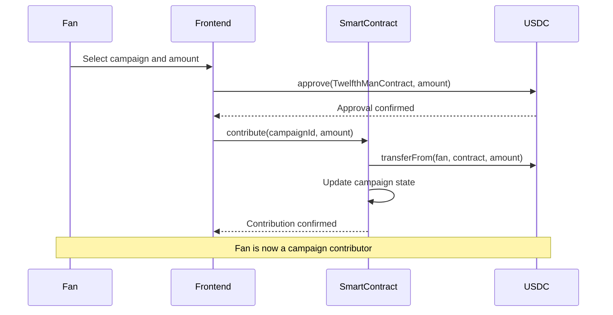

# 12th Man App

Decentralized crowdfunding platform for football clubs built on Chiliz blockchain, empowering fans to support their teams while earning returns.

## Description

### What Is It?

12th Man App is a Web3 crowdfunding platform that connects football fans with their favorite clubs through decentralized lending. Fans can directly fund their clubs' projects and campaigns in exchange of attractive interest rates, creating a sustainable financing model that benefits both supporters and teams.

It works like a **decentralized investment platform** where fans become the **12th on the field** by providing financial support to help their clubs achieve their goals.

### How It Works (Conceptually)

- **Clubs** create funding campaigns for specific projects (transfers, infrastructure, equipment, etc.)
- **Fans** browse available campaigns and choose where to invest their money
- **Smart contracts** on Chiliz blockchain handle all transactions securely and transparently
- **Investors** earn interest on their contributions based on campaign terms
- **KYC verification** ensures regulatory compliance of all clubs creating a campaign

### Why It's Special

- **Fan-centric**: Gives supporters a real way to impact their club's success
- **Transparent**: All transactions and campaign progress visible on blockchain
- **Profitable**: Fans earn competitive interest rates on their investments
- **Decentralized**: No traditional banks or intermediaries involved
- **Sport-focused**: Built specifically for football clubs and their communities
- **Regulatory compliant**: Includes KYC processes for legal compliance

## Technical

### Platform Architecture



### Campaign Creation & Management



**Campaign Parameters:**
- `clubName`: Name of the football club
- `targetAmount`: Funding goal in USDC tokens
- `annualInterestRate`: Interest rate in basis points (e.g., 4000 = 40%)
- `duration`: Campaign duration in seconds
- `deadline`: Automatic calculation of end date

### Investment Flow



**How are we profitable?** --> We charge 5% of the users yield. 


### Smart Contract Architecture

**Chiliz Spicy Testnet**
```
TwelfthMan Contract (`0x90D3d31175b47801ea55d010629B25726aE0AD53`)
USDC Token Contract (`0xa37936f56249965d407e39347528a1a91eb1cbef`)
```


### Environment Variables
```env
# Database
MONGODB_URI=mongodb+srv://..................
```

#### Wallet Setup
1. Add Chiliz Spicy Testnet to MetaMask
2. Get testnet CHZ tokens from faucet
3. Acquire USDC tokens for testing
4. Connect wallet to the application


### Demo Video 

<iframe width="560" height="315" src="https://youtu.be/KsyzALDGJdw?si=nrHpZyC2U2pHNK-K" frameborder="0" allowfullscreen></iframe>


