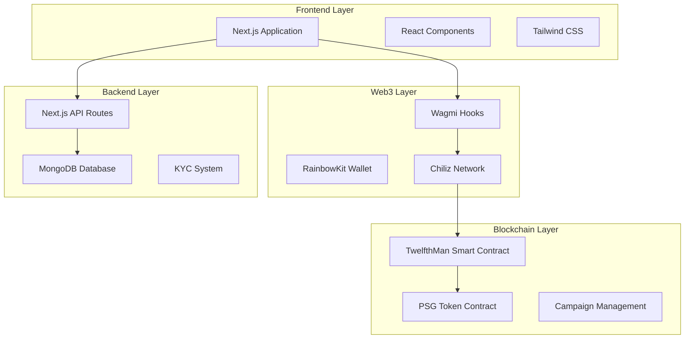
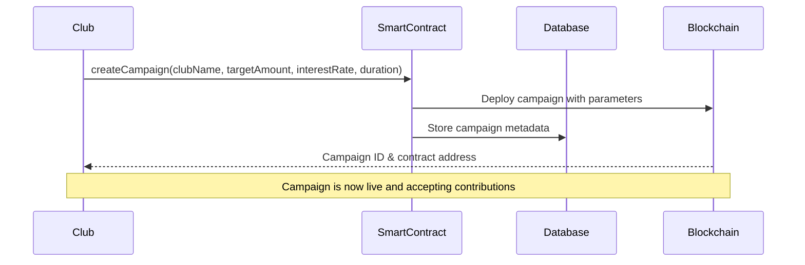
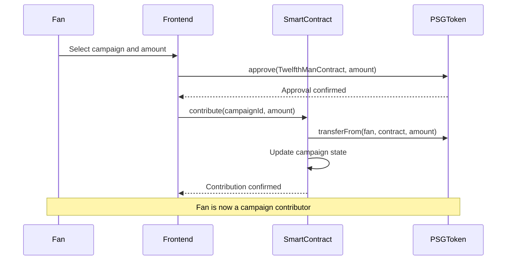

# 12th Man App


## Description

### What Is It?

12th Man App is a Web3 crowdfunding platform that connects football fans with their favorite clubs through decentralized lending. Fans can directly fund their clubs' projects and campaigns in exchange of attractive interest rates, creating a sustainable financing model that benefits both supporters and teams.

It works like a **decentralized investment platform** where fans become the **12th on the field** by providing financial support to help their clubs achieve their goals.

### How It Works (Conceptually)

- **Clubs** create funding campaigns for specific projects (transfers, infrastructure, equipment, etc.)
- **Fans** browse available campaigns and choose where to invest their money
- **Smart contracts** on Chiliz blockchain handle all transactions securely and transparently
- **Investors** earn interest on their contributions based on campaign terms
- **KYC verification** ensures regulatory compliance of all clubs creating a campaign

### Why It's Special

- **Fan-centric**: Gives supporters a real way to impact their club's success
- **Transparent**: All transactions and campaign progress visible on blockchain
- **Profitable**: Fans earn competitive interest rates on their investments
- **Decentralized**: No traditional banks or intermediaries involved
- **Sport-focused**: Built specifically for football clubs and their communities
- **Regulatory compliant**: Includes KYC processes for legal compliance

## Technical

### Platform Architecture



### Campaign Creation & Management



**Campaign Parameters:**
- `clubName`: Name of the football club
- `targetAmount`: Funding goal in PSG tokens
- `annualInterestRate`: Interest rate in basis points (e.g., 4000 = 40%)
- `duration`: Campaign duration in seconds
- `deadline`: Automatic calculation of end date

### Investment Flow



### KYC Requirements:

- Club name and legal status
- Registration number and address
- Representative identification
- Legal documentation links
- Optional federation affiliation

### Smart Contract Architecture

The platform uses two main smart contracts on Chiliz Spicy Testnet:

#### TwelfthMan Contract (`0x90D3d31175b47801ea55d010629B25726aE0AD53`)
- **Campaign Management**: Create, fund, and manage campaigns
- **Contribution Tracking**: Record all fan contributions
- **Interest Calculation**: Compute returns based on campaign terms
- **Refund System**: Handle unsuccessful campaign refunds
- **Access Control**: Manage permissions and KYC requirements

#### PSG Token Contract (`0xb0Fa395a3386800658B9617F90e834E2CeC76Dd3`)

### Configuration

#### Environment Variables
```env
# Database
MONGODB_URI=mongodb+srv://..................

# Chiliz Network
NEXT_PUBLIC_CHILIZ_RPC_URL=https://spicy-rpc.chiliz.com
NEXT_PUBLIC_CHILIZ_CHAIN_ID=88882

# Smart Contracts
NEXT_PUBLIC_TWELFTH_MAN_CONTRACT=0x90D3d31175b47801ea55d010629B25726aE0AD53
NEXT_PUBLIC_PSG_TOKEN_CONTRACT=0xb0Fa395a3386800658B9617F90e834E2CeC76Dd3
```

#### Wallet Setup
1. Add Chiliz Spicy Testnet to MetaMask
2. Get testnet CHZ tokens from faucet
3. Acquire PSG tokens for testing
4. Connect wallet to the application

### Usage

1. **Connect Wallet**: Use RainbowKit to connect your Web3 wallet
2. **Complete KYC**: Submit required verification documents
3. **Browse Campaigns**: Explore available club funding opportunities
4. **Make Investment**: Choose campaign and contribute PSG tokens
5. **Track Progress**: Monitor your investments and returns
6. **Claim Rewards**: Withdraw earnings when campaigns succeed

## Technology Stack

### Frontend
- **Next.js 15**: React framework with App Router
- **TypeScript**: Type-safe JavaScript development
- **Tailwind CSS**: Utility-first CSS framework
- **React**: Component-based UI library

### Web3 Integration
- **Wagmi**: React hooks for Ethereum
- **RainbowKit**: Wallet connection interface
- **Viem**: TypeScript Ethereum library
- **Chiliz Network**: Sports-focused blockchain

### Backend
- **Next.js API Routes**: Serverless API endpoints
- **MongoDB**: NoSQL database for user data
- **Mongoose**: MongoDB object modeling

### Smart Contracts
- **Solidity**: Contract programming language
- **Chiliz Testnet**: Deployment network
- **OpenZeppelin**: Secure contract templates
---

